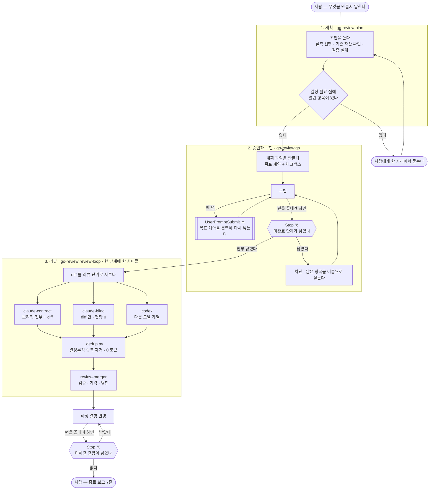

# go-skill

계획을 세우고, 승인하고, **그 계획이 끝날 때까지 턴이 끝나지 않게** 하는 Claude Code 플러그인.
구현이 끝나면 문맥이 서로 다른 리뷰어를 병렬로 띄우고, 별도 병합자가 그 결과를 검증·기각한다.

사람은 **앞(협의문)과 뒤(최종 보고)에만** 있고 중간에 없다. 중간을 지탱하는 것이 훅이다.

```
/plugin marketplace add jwjinn/go-skill
/plugin install go-review@jwjinn-go-skill
/plugin install go-tester@jwjinn-go-skill    # 선택 — 테스트를 로컬 모델에 위임한다
/plugin install go-fanout@jwjinn-go-skill    # 선택 — 그 체인을 여러 워커에 fan-out 한다
```

| 플러그인 | 무엇 | 없어도 되나 | 추가로 필요한 것 |
|---|---|---|---|
| `go-review` | 계획 승인 · 완주 집행 · 교차 리뷰 | **본체** | `jq` · `python3` · `git` |
| `go-tester` | 테스트를 로컬 모델에 위임 | 선택 | 로컬 모델 엔드포인트 · `uvx` · `curl` |
| `go-fanout` | 그 체인을 워커 N명에 fan-out | 선택 | **Orca 런타임** |

`go-tester` 는 **기본이 꺼져 있다.** 계획을 만들 때와 돌릴 때 사람이 두 번 답해야 켜지고,
답하지 않으면 호출이 0회다. 자세한 것은 [plugins/go-tester/README.md](plugins/go-tester/README.md).

⛔ **`go-fanout` 은 Orca 가 있어야 한다.** 워커를 Orca 오케스트레이션으로 띄우므로 `orca` 명령이
없으면 아무것도 하지 못한다. 설치돼 있는지는 한 줄로 확인한다 — `orca status --json`.
(훅은 orca 가 없으면 **조용히 통과한다.** orca 를 안 쓰는 세션을 멈춰 세우지 않기 위해서인데,
그 대가로 「안 깔렸다」와 「깔렸는데 할 일이 없다」가 같은 침묵으로 보인다. 위 한 줄이 그것을 가른다.)

⚠ **셋을 섞어 설치하지 마라 — 같은 방식으로 받아라.** 셋은 서로를 **형제 자리**에서 찾는다.
마켓플레이스로 받으면 셋 다 `~/.claude/plugins/cache/...` 에 형제로 놓이고, 개발용 심링크로
쓰면 셋 다 `~/.claude/skills/` 에 형제로 놓인다. 하나만 심링크이고 나머지가 마켓플레이스면
그 하나가 형제를 못 찾는다. 찾는 규칙의 정본은 `plugins/go-review/hooks/_plugins.sh` 하나다.

설치 직후 한 줄로 이 기계에서 실제로 도는지 확인한다(중요 — 아래 [의존성](#의존성--설치됐다와-돌아간다는-다르다) 절):

```bash
bash "$HOME/.claude/plugins/marketplaces/jwjinn-go-skill/plugins/go-review/scripts/deps-check.sh"
```

---

## 전체 흐름



공유용 2장 요약이 [`docs/go-review-workflow.pdf`](docs/go-review-workflow.pdf) 에 있다
(원본 HTML 도 같이 둔다 — PDF 만 두면 낡았을 때 고칠 수단이 없다).

### 훅이 언제 끼어드나

세 이벤트에만 붙는다. 그 밖의 시간에는 아무 일도 하지 않는다.

| 이벤트 | 훅 | 하는 일 | 막나 |
|---|---|---|---|
| 세션 시작 | `doctor.sh` | 체인이 살아 있는지 9가지를 센다. 전부 통과면 조용하다 | 아니오 |
| 프롬프트 제출 | `goal-echo.sh` | 원 요청·수용 기준·범위 밖을 문맥에 다시 넣는다 | 아니오 |
| 프롬프트 제출 | `go-precheck.sh` | `/go` 를 계획 없이 쓰면 그 사실을 문맥에 넣는다 | 아니오 |
| 턴 종료 | `plan-file-gate.sh` | 계획 파일에 미완료 체크박스가 남았으면 거부한다 | **예** |
| 턴 종료 | `todo-completion-gate.sh` | 마지막 `TodoWrite` 에 미완료가 남았으면 거부한다 | **예** |
| 턴 종료 | `review-gate.sh` | 확정 결함이 미해결이면 거부한다 | **예** |
| 턴 종료 | `worker-question-gate.sh` | 워커가 답을 기다리는데 턴을 끝내면 거부한다(go-fanout) | **예** |
| 턴 종료 | `wave-close-gate.sh` | 파도가 끝났는데 자원을 안 치웠으면 거부한다(go-fanout) | **예** |

차단 축이 둘인 이유는 실측이다. `TodoWrite` 도구가 **하네스 빌드에 아예 없는 세션**이
나왔고, 그때 도구 축은 「계획을 안 세운 턴」으로 보고 조용히 통과했다. 12단계 계획이
1단계만 하고 끝나도 잡히지 않았다. 파일 축은 도구가 아니라 파일을 보므로 그 조건에서도 작동한다.

### 실제로 무엇이 보이나

미완료 계획을 남긴 채 턴을 끝내려 하면 이렇게 나온다.

```
계획 12단계 중 7개가 미완료인데 턴을 끝내려 했다.
계획 파일: /repo/.claude/plan-active.md

  14: [ ] P2 — 인덱서 재동기화 상한
  15: [ ] P3 — 대조군 2종
  …

승인된 다단계 계획은 완주한다. 단계 경계는 멈춤 지점이 아니다 —
"이어할까요?" 를 묻지 말고 다음 항목을 진행하고, 끝낸 항목은 그 파일에서 [x] 로 닫아라.
```

완화 장치가 넷 들어 있다. 이것이 없으면 사람이 훅을 끄고, 그러면 게이트가 통째로 사라진다.

- 세션당 상한 8회. 그 이상은 막지 않는다(`CLAUDE_PLAN_GATE_MAX` 등으로 조절)
- 훅이 고장 나면 통과한다. 관측이 작업을 죽이면 안 된다
- 낡은 계획은 자동 만료된다. 판별은 「사용자가 그 계획 이후로 말했는가」 하나다
- 진전이 없으면(미완료가 3회 연속 안 줄면) 차단을 풀고 「무엇이 막고 있나」를 말한다
- **이 세션이 채택한 계획만 막는다.** 계획 파일은 워크트리에 하나이므로, 같은 워크트리에서
  세션 A 가 계획을 진행하는 동안 세션 B 가 별건을 하면 B 가 A 의 미완료로 막혔다(2026-09-16
  실측 — B 는 그 파일을 쓰지도 `go-review:go` 를 부르지도 않았다). 채택의 근거는 transcript 의
  행위 흔적이다: 사람 프롬프트의 go 호출 · `Skill` 도구 호출 · 그 파일을 **쓴** 도구
  (`Write`/`Edit` · Bash 재지향). 읽기는 채택이 아니다. 남의 계획일 때는 막지 않되 세션당
  한 번 「이 세션의 것이 아니다」를 알린다 — 조용한 통과와 검사한 통과는 다르다.
  판별 불가(transcript 부재·사람 발화 0)는 **차단 유지**다

---

## 무엇이 설치되나

```
go-review/
├── commands/          3개 — 스킬로 로드된다(호출 이름은 아래 「부르는 법」)
│   ├── plan.md            계획 초안. 실측 선행 · 기존 자산 확인 · 검증 설계 · 병렬 배치 · 자원 회수
│   ├── go.md              승인. 계획 파일 생성 · 목표 계약 · 완주 추적 · 종료 보고 7절
│   └── review-loop.md     리뷰 1사이클. 리뷰어 병렬 → 중복 제거 → 병합 → 반영
├── agents/            3개 — 서브에이전트 정의(전부 읽기 전용: tools 가 Read·Grep·Glob 뿐)
│   ├── reviewer-contract.md   요구 충족 · 목표 이탈 · 구현자의 주장이 사실인가
│   ├── reviewer-blind.md      diff 만 보고 결함을 찾는다(구현 의도를 주지 않는다)
│   └── review-merger.md       검증 · 기각 · 병합. 기각이 본체다
├── hooks/             6개 + 공용 함수 2개 — 위 「훅이 언제 끼어드나」 표
│   ├── _planpath.sh           계획 경로·소유자 파싱(세 훅이 공유한다)
│   └── _deps.sh               외부 도구 정의와 부재 알림
├── review/            리뷰 실행·측정 스크립트
│   ├── codex-ro.sh            codex 호출의 유일한 입구. 읽기 전용을 여기서 못박는다
│   ├── _config.py             어느 구성이 도는지 해석하고 그 선택의 대가를 말한다
│   ├── _dedup.py              세 리뷰어 JSON 을 결정론적으로 묶는다(0 토큰)
│   ├── _scope.py              diff 크기로 리뷰 라운드를 자른다
│   ├── verdict.sh             사람 판정(정밀도). 모델이 못 채우는 축이다
│   ├── measure.sh · history.sh  절제 · 정밀도 · 재현율 집계
│   ├── finding-schema.json    세 리뷰어가 공유하는 발견 형식(codex 는 강제된다)
│   └── eval/                  정답을 아는 회귀 케이스 25건(그중 9건이 대조군)
└── scripts/
    ├── deps-check.sh          이 기계에서 실제로 도는지 센다
    └── deps-check.test.sh     그 검사기의 대조군 41검사

`hooks/_plugins.sh` 는 **형제 플러그인의 설치 위치**를 찾는다. 셋은 한 저장소에서 나오므로
언제나 형제 자리에 있고, 설치 방식마다 「형제」의 모양만 다르다. 그 규칙의 정본은 그 파일
하나다 — 문서·훅이 각자 경로를 적으면 설치 모양이 하나 늘 때 반드시 한둘을 놓친다.
```

설치해도 **프로젝트 파일은 하나도 만들지 않는다.** 상태 파일(`.claude/plan-active.md`·
`.claude/review-active.md`)은 `/go` 와 `/review-loop` 이 실행될 때 생기고, 일이 끝나면 지운다.

### 부르는 법

이 저장소에는 `.claude/commands/` 가 없다. 명령은 **플러그인 스킬**로 로드되므로 이름이 다르다.

```
go-review:plan          계획 초안
go-review:go            승인 → 구현 시작
go-review:review-loop   리뷰 1사이클
```

`/go` 라는 슬래시 명령은 **존재하지 않는다.** 세션 시작 진단(`doctor.sh` ⑧)이 매번 이 이름을
말한다 — 문서가 `/go` 로 안내해 사용자가 두 번 헛친 적이 있어서 넣은 검사다.

---

## 의존성 — 「설치됐다」와 「돌아간다」는 다르다

| 도구 | 구분 | 없으면 무슨 일이 나나 |
|---|---|---|
| `bash` · `git` | 필수 | 실행기 자신 · 리뷰 범위 산정(diff) · 워크트리 판별 |
| `jq` | **필수** | Stop 게이트 3축과 목표 재주입이 **붙어 있는 채로 아무것도 보지 않는다** |
| `python3` (3.6+) | 필수 | 구성 해석 · 중복 제거 · 측정 · 회귀 평가 전량 |
| `codex` | 선택 | 교차 모델 리뷰어. 없으면 preset 을 P1 로 내리고 그 자리를 비운다(리뷰는 돈다) |
| `timeout` | 선택 | codex 호출의 시간 상한. `gtimeout` 이 있으면 그것을 쓰고, 둘 다 없으면 상한 없이 부른다 |

`jq` 를 필수로 표시한 이유는 실측이다. 미완료 2개짜리 계획을 두고 PATH 에서 jq 만 뺐더니
`plan-file-gate.sh` 가 **출력 0바이트 · 종료코드 0** 이었다. 훅은 등록돼 있고, 계획도 있고,
미완료도 남아 있는데 아무 일도 일어나지 않는다. 그리고 그 사실을 아무도 모른다.

지금은 그 조건에서 게이트가 통과하되 **침묵하지 않는다.** 침묵하는 fail-open 과
알려진 fail-open 은 다르다.

```
[go-review] ⛔ `jq` 가 없다. 그래서 이번 턴에 다음 축이 무장되지 않았다:
    계획 완주 게이트(파일 축 — .claude/plan-active.md)
  이 상태에서는 미완료 계획이 남아 있어도 턴이 그냥 끝난다. 게이트가 「통과」한 것이 아니라
  아무것도 보지 않았다 — 조용한 통과와 검사한 통과를 같은 것으로 읽지 마라.
  설치: brew install jq   |   apt-get install -y jq   |   dnf install -y jq
```

### 확인하는 법

```bash
bash scripts/deps-check.sh          # 있는지 본다(1초)
bash scripts/deps-check.sh --deep   # + codex 를 실제로 한 번 불러 돌아가는지 본다
```

`--deep` 이 따로 있는 이유도 실측이다. codex 0.152.0 이 설치돼 있는데 기본 모델이 CLI
업그레이드를 요구해 **한 줄도 못 돌았고**, 구성 해석은 `command -v codex` 만 보므로 전 자리를
codex 로 둔 채 진행해서 그 라운드의 리뷰가 0회였다. 「있다」와 「돌아간다」를 다른 검사로 나눈다.

출력 예:

```
[의존성 점검] 7검사 · 충족 7 · 경고 0 · 부재 0
── 필수 ────────────────────────────────────────────
  ✅ bash     3.2.57(1)-release
  ✅ git      git version 2.50.1
  ✅ jq       jq-1.7.1
  ✅ python3  Python 3.9.6
── 선택 ────────────────────────────────────────────
  ✅ timeout  timeout 로 쓴다
  ✅ codex    codex-cli 0.153.4
── 리뷰 구성 ───────────────────────────────────────
  ✅ 리뷰 자리: codex-contract,codex-blind
```

판정은 셋이다. **0** 전부 충족 · **1** 선택 도구 부재(체인은 돈다) · **2** 필수 부재(축이 죽는다).

---

## 처음 한 번 — 5분

```
1) go-review:plan  대시보드 폴링을 줄이고 그 효과를 실측한다

   초안이 나온다. 끝에 `## 결정 필요(승인 전)` 절이 있고, 열린 항목이 있으면
   /go 가 착수하지 않는다. 질문은 여기서 한 자리에 모여 나온다.

2) (답한다)

   답이 본문을 바꾸면 그 재작성까지가 「닫힘」이다.

3) go-review:go  전부

   .claude/plan-active.md 가 생기고 구현이 시작된다.
   이후 매 턴 목표 계약이 문맥에 다시 들어가고, 단계가 남으면 턴이 끝나지 않는다.

4) go-review:review-loop

   리뷰어가 병렬로 돌고 병합자가 검증·기각한 결과가 .claude/review-active.md 에 남는다.
   확정 결함을 안 고치면 턴이 끝나지 않는다.

5) (끝나면 종료 보고 7절이 나온다)

   협의문 대비 판정 · 만든 것 · 리뷰 히스토리 · 검증(몇 개를 셌나) ·
   못 한 것 · 사람이 해야 하는 것 · 이런 일들이 있었다.
```

### 멈추게 하려면

```bash
rm .claude/plan-active.md      # 완주 축이 아무것도 보지 않는다
rm .claude/review-active.md    # 리뷰 축이 아무것도 보지 않는다
```

플러그인 자체를 끄려면 `/plugin` 에서 비활성화한다.

---

## 리뷰 구성 — 자리와 모델은 다른 축이다

리뷰어를 가르는 것은 **받는 정보**이지 모델이 아니다. 따라서 어느 모델이든 어느 자리에나
앉을 수 있고, 그 선택은 지시문이 아니라 구성 파일에 있다.

| 자리 | 받는 것 | 묻는 것 |
|---|---|---|
| `contract` | 브리핑 전부 + diff | 요구를 충족했나 · 목표를 벗어났나 · **구현자의 주장이 사실인가** |
| `blind` | diff **만** | 이 코드에 무엇이 잘못됐나(편향 0) |
| `cross` | 목표 한 문단 + diff | 다른 모델 계열의 눈 |
| `merger` | 후보 목록 | **검증 · 기각 · 판정** |

| preset | contract | blind | cross | merger |
|---|---|---|---|---|
| `P1` | claude | claude | codex | claude |
| `P2` (기본) | codex | codex | — | codex |
| `P2c` | codex | codex | — | claude |
| `P3` | — | codex | — | codex |

프로젝트마다 바꾸려면 `.claude/review/config.json` 을 두고 `preset` 을 적는다. 플러그인의
`config.default.json` 을 고치지 마라 — 다음 업데이트에 덮인다. 어느 파일을 읽었는지는
`python3 review/_config.py` 가 말해 준다.

codex 가 없으면 스크립트가 preset 을 **P1 로 내리고 codex 자리를 비운다.** 종전에는 이것이
지시문 한 줄의 규율이었고, 빠뜨리면 기본 preset 의 전 자리가 codex 라 그 라운드의 리뷰가
**0회**가 되는 방향이었다.

---

## 왜 이 모양인가

자기 리뷰를 **구조적으로 못 하게 하는 것**이 설계의 전부다. 측정된 서열은 신선한 문맥의
리뷰어 F1 28.6% > 자기 리뷰 24.6% > 의도까지 받은 리뷰 23.8% > 같은 세션 2회차 21.7%
(arXiv 2603.12123 · 프리프린트). 그래서 리뷰어를 서로 다른 인식론적 위치에 세운다.

교차 모델 리뷰는 **대칭이 아니다.** Claude 코드를 Codex 가 리뷰한 조건은 −8.6pp,
반대 방향은 +18.1pp 였다(arXiv 2607.21656 · 프리프린트). 그래서 Codex 단독 발견을
must_fix 로 직행시키지 않고, 병합자가 직접 코드를 열어 확인해야 확정이 된다.

근거 문헌이 전부 프리프린트이므로 측정은 직접 쌓는다. 재는 축이 셋이다.

- **절제** — 그 리뷰어를 빼면 놓쳤을 must_fix. `rounds.jsonl`
- **정밀도** — 그중 몇 건이 옳았나. **사람만 안다.** `verdict.sh` 가 라벨을 받고, 라벨이
  없으면 `measure.sh` 는 숫자를 지어내지 않고 「계산하지 않았다」고 말한다
- **재현율** — 있었는데 아무도 못 본 결함. 실사용 라운드로는 못 잰다. 정답을 아는
  회귀 케이스 25건으로만 잰다. **그중 9건이 대조군**(결함 없는 diff, 정답은 「보고하지 않는 것」)
  이고, 없으면 「전부 결함이라고 답하는」 리뷰어가 재현율 100% 로 만점을 받는다

---

## 검증

게이트 자신에 **14스위트 439검사**가 붙어 있다. 그중 상당수가 대조군이다 —
보호를 지웠을 때 실제로 실패하는지 확인한다.

```bash
cd plugins/go-review
for t in hooks/*.test.sh review/*.test.sh review/eval/*.test.sh scripts/*.test.sh; do
  bash "$t" >/dev/null 2>&1 || echo "⛔ $t"
done
bash hooks/doctor.sh --stamp    # 통과했다고 표시한다
```

「이 테스트가 지킨다」는 주장은 **보호를 지웠을 때 실제로 실패**해야 참이다. 여러 번
「지운 뒤에도 통과」해서 주석이 거짓임이 드러났다.

---

## 개발 기계에서는 심링크

`~/.claude/skills/<이름>/` 에 놓인 플러그인은 다음 세션에 `<이름>@skills-dir` 로 자동
로드된다. 이 저장소를 그대로 가리키면 푸시 없이도 전역이고, 고친 것이 바로 반영된다.

```bash
ln -sfn "$PWD/plugins/go-review" ~/.claude/skills/go-review
claude plugin list
```

⚠ 심링크와 마켓플레이스 설치를 **동시에 두지 마라.** 같은 훅이 두 번 돌고 에이전트 이름이
충돌한다. 세션 시작 진단 ①이 그 상태를 잡는다.

---

## 라이선스

MIT
