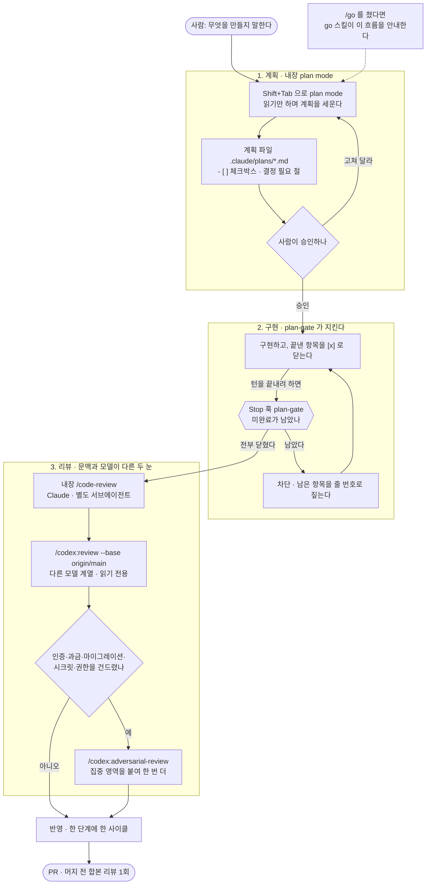
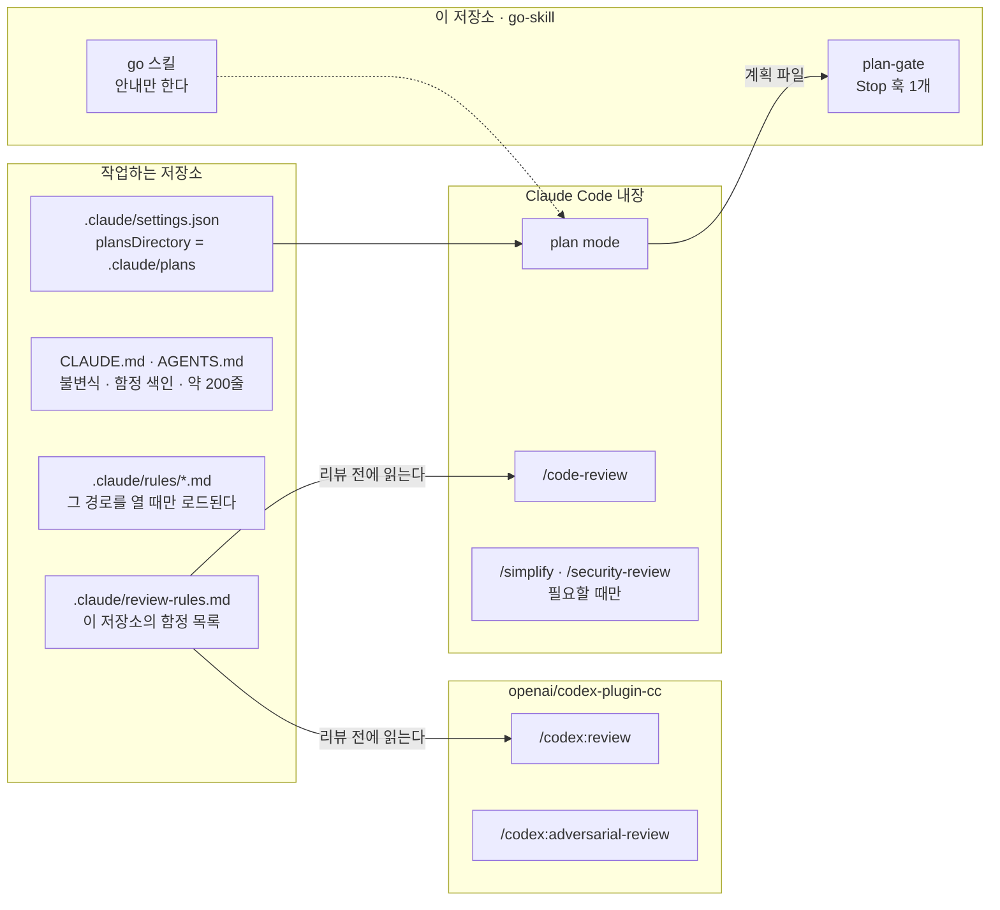
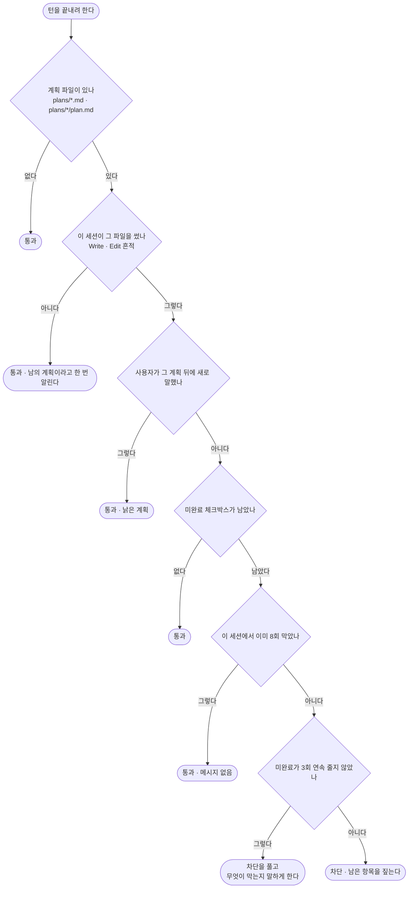

# go-skill

Claude Code 로 개발할 때 「계획 → 구현 → 리뷰 → 반영」을 굴리는 최소 구성이다.
2026-10-10 에 크게 줄였고, 지금 이 저장소가 직접 제공하는 것은 둘뿐이다.

| 이름 | 종류 | 하는 일 |
|---|---|---|
| `plan-gate` | 플러그인 (Stop 훅 1개) | 승인된 계획 파일에 미완료 체크박스가 남았는데 턴을 끝내려 하면 거부한다 |
| `go` | 스킬 (사용자 호출 전용) | 손에 익은 대로 `/go` 를 치면 새 흐름을 안내한다 |

나머지 단계는 Claude Code 내장 기능과 OpenAI 의 공식 codex 플러그인([openai/codex-plugin-cc](https://github.com/openai/codex-plugin-cc))이 맡는다.
예전 체인(go-review · go-tester · go-fanout · go-coder)은 `plugins/` 에 보관만 한다([보관](#보관)).

---

## 개발 흐름


```mermaid
flowchart TD
    U(["사람: 무엇을 만들지 말한다"]) --> PM
    G["/go 를 쳤다면<br/>go 스킬이 이 흐름을 안내한다"] -.-> PM

    subgraph S1["1. 계획 · 내장 plan mode"]
        PM["Shift+Tab 으로 plan mode<br/>읽기만 하며 계획을 세운다"] --> PF["계획 파일 .claude/plans/*.md<br/>- [ ] 체크박스 · 결정 필요 절"]
        PF --> OK{"사람이 승인하나"}
    end

    OK -->|"고쳐 달라"| PM
    OK -->|"승인"| IM

    subgraph S2["2. 구현 · plan-gate 가 지킨다"]
        IM["구현하고, 끝낸 항목을 [x] 로 닫는다"] -->|"턴을 끝내려 하면"| GT{{"Stop 훅 plan-gate<br/>미완료가 남았나"}}
        GT -->|"남았다"| BL["차단 · 남은 항목을 줄 번호로 짚는다"]
        BL --> IM
    end

    GT -->|"전부 닫혔다"| CR

    subgraph S3["3. 리뷰 · 문맥과 모델이 다른 두 눈"]
        CR["내장 /code-review<br/>Claude · 별도 서브에이전트"] --> CX["/codex:review --base origin/main<br/>다른 모델 계열 · 읽기 전용"]
        CX --> SEN{"인증·과금·마이그레이션·<br/>시크릿·권한을 건드렸나"}
        SEN -->|"예"| ADV["/codex:adversarial-review<br/>집중 영역을 붙여 한 번 더"]
    end

    SEN -->|"아니오"| FX
    ADV --> FX["반영 · 한 단계에 한 사이클"]
    FX --> PR(["PR · 머지 전 합본 리뷰 1회"])
```

사람은 앞(무엇을 만들지, 계획 승인)과 뒤(PR)에 있고, 중간을 지탱하는 것은 Stop 훅 하나다.

### 다섯 줄로

```
1) Shift+Tab → plan mode.   「대시보드 폴링을 줄이고 그 효과를 잰다」
2) 계획이 나오면 승인한다.     계획 파일에 - [ ] 가 있으면 완주 대상이 된다
3) 구현한다.                 끝낸 항목은 [x] 로 닫는다. 남은 채로는 턴이 끝나지 않는다
4) /code-review  →  /codex:review --base origin/main
5) 반영하고 PR.
```

멈추게 하려면 계획 파일을 지우거나 체크박스를 전부 닫는다. 범위 밖으로 뺀 항목은 `[x]` 로 위장하지 말고 줄을 지운다.

---

## 무엇이 어디에 있나


```mermaid
flowchart LR
    subgraph CC["Claude Code 내장"]
        A1["plan mode"]
        A2["/code-review"]
        A3["/simplify · /security-review<br/>필요할 때만"]
    end

    subgraph GS["이 저장소 · go-skill"]
        B1["plan-gate<br/>Stop 훅 1개"]
        B2["go 스킬<br/>안내만 한다"]
    end

    subgraph OX["openai/codex-plugin-cc"]
        C1["/codex:review"]
        C2["/codex:adversarial-review"]
    end

    subgraph PJ["작업하는 저장소"]
        P1[".claude/settings.json<br/>plansDirectory = .claude/plans"]
        P2["CLAUDE.md · AGENTS.md<br/>불변식 · 함정 색인 · 약 200줄"]
        P3[".claude/rules/*.md<br/>그 경로를 열 때만 로드된다"]
        P4[".claude/review-rules.md<br/>이 저장소의 함정 목록"]
    end

    P1 --> A1
    A1 -->|"계획 파일"| B1
    P4 -->|"리뷰 전에 읽는다"| A2
    P4 -->|"리뷰 전에 읽는다"| C1
    B2 -.-> A1
```

| 자리 | 무엇을 두나 | 왜 거기인가 |
|---|---|---|
| `CLAUDE.md` / `AGENTS.md` | 빌드 명령 · 불변식 · 반복 함정 색인 | 매 세션 전부 로드된다. 공식 문서는 파일당 200줄 미만을 권한다 |
| `.claude/rules/*.md` | 특정 경로에서만 필요한 절차(`paths:` frontmatter) | 그 경로의 파일을 열 때만 로드된다 |
| `.claude/review-rules.md` | 이 저장소에서 반복된 결함과 심각도 기준 | 어떤 리뷰 도구를 쓰든 입력으로 준다 |
| `docs/` | 절차의 사연·이력 | 로드되지 않는다. 필요할 때 연다 |

---

## plan-gate 가 판정하는 방식


```mermaid
flowchart TD
    S(["턴을 끝내려 한다"]) --> Q1{"계획 파일이 있나<br/>plans/*.md · plans/*/plan.md"}
    Q1 -->|"없다"| P0(["통과"])
    Q1 -->|"있다"| Q2{"이 세션이 그 파일을 썼나<br/>Write · Edit 흔적"}
    Q2 -->|"아니다"| P1(["통과 · 남의 계획이라고 한 번 알린다"])
    Q2 -->|"그렇다"| Q3{"사용자가 그 계획 뒤에 새로 말했나"}
    Q3 -->|"그렇다"| P2(["통과 · 낡은 계획"])
    Q3 -->|"아니다"| Q4{"미완료 체크박스가 남았나"}
    Q4 -->|"없다"| P3(["통과"])
    Q4 -->|"남았다"| Q5{"이 세션에서 이미 8회 막았나"}
    Q5 -->|"그렇다"| P4(["통과 · 메시지 없음"])
    Q5 -->|"아니다"| Q6{"미완료가 3회 연속 줄지 않았나"}
    Q6 -->|"그렇다"| R(["차단을 풀고<br/>무엇이 막는지 말하게 한다"])
    Q6 -->|"아니다"| B(["차단 · 남은 항목을 짚는다"])
```

차단 문구는 이렇게 나온다.

```
계획 1단계 중 1개가 미완료인데 턴을 끝내려 했다.
계획 파일: /repo/.claude/plans/flat-plan.md

  2: [ ] 미완

승인된 다단계 계획은 완주한다. 단계 경계는 멈춤 지점이 아니다 …
정말 멈춰야 하는 경우는 둘뿐이고, 그때는 멈추기 전에 그 사유를 말해야 한다
```

완화 장치를 그대로 두었다. 없으면 사람이 훅을 끄고, 그러면 게이트가 통째로 사라진다.

- 세션당 상한 8회(`CLAUDE_PLAN_GATE_MAX`). 그 뒤로는 메시지 없이 통과한다
- 미완료가 3회 연속 줄지 않으면 차단을 풀고 「무엇이 막고 있나」를 말하게 한다
- 훅 자체가 고장 나면 통과한다. 다만 `jq` 가 없어서 아무것도 못 본 경우에는 그 사실을 알린다
- 이 세션이 쓴 계획만 막는다. 같은 워크트리의 다른 세션 계획에는 걸리지 않는다
- 판별할 수 없으면(transcript 부재 등) 차단을 유지한다. 모르는 것을 근거로 열면 게이트가 무력해진다

---

## 무엇이 바뀌었나 (2026-10-10)

| 자리 | 전 | 후 |
|---|---|---|
| 계획 · 승인 | `go-review:plan` → `go-review:go` (지시문 1,066줄) | 내장 plan mode |
| 완주 강제 | Stop 훅 3축 + 매 턴 목표 재주입 + 세션 시작 진단 | `plan-gate` 하나 |
| 리뷰 | `review-loop`: 리뷰어 셋 + 병합자 + 중복 제거 · 판정 · 측정 스크립트 | 내장 `/code-review` + `/codex:review` |
| 테스트 위임 | `go-tester` (로컬 모델) | 세션이 직접 쓴다 |
| 병렬 워커 | `go-fanout` | 오케스트레이터만 쓰고, 워커마다 위 흐름을 그대로 돈다 |
| 코드 규모 | go-review 실행 코드 약 6,000줄 + 지시문 약 2,000줄 · go-tester 2,507줄 · go-fanout 4,068줄 | plan-gate 751줄(공용 함수 포함) + 대조군 439줄 |

### 왜 줄였나

이 체인을 실제로 쓰던 저장소의 60일 기록(2026-08-11 ~ 10-10)이다.

| 지표 | 값 |
|---|---|
| 이 저장소의 커밋 중 체인 자체를 고친 커밋 | 39 중 18 |
| 리뷰 발견 중 사람이 판정한 것 | 1,763 중 16. 나머지 1,585건은 자동 판정(자기 채점)이었다 |
| 토큰을 기록한 리뷰 라운드 | 179 중 1 |
| 테스트 위임이 정상 종료한 비율 | 33회 중 7회 |
| 설치된 스킬 중 60일간 한 번도 호출되지 않은 것 | 40개 이상 |

정밀도를 재려고 만든 측정 계층은 사람 판정이 거의 없어서 어떤 결정에도 쓰이지 못했고, 체인을 유지하는 일이 따로 하나의 프로젝트가 되어 있었다.
가치가 확인된 것은 두 가지였다. 문맥이 다른 리뷰어가 서로 다른 결함을 찾는다는 것, 그리고 승인된 계획이 1단계에서 멈추는 일을 훅이 막는다는 것이다.
앞의 것은 이제 Claude Code 와 codex 플러그인이 기본으로 제공하므로, 이 저장소에는 뒤의 것만 남겼다.

### 2주 뒤에 다시 잰다

전환을 확정하기 전에 같은 저장소에서 같은 식으로 다시 잰다. 1차 지표는 PR 당 캐시 읽기 토큰(매 턴 다시 읽히는 문맥의 크기)이고, 30% 이상 줄지 않으면 해당 단계만 되돌린다.
리뷰 품질은 새 흐름을 거친 PR 두 개에 옛 `review-loop` 도 한 번 돌려 결함 목록을 사람이 판정해 비교한다.

---

## 검증 (2026-10-11)

결함 두 개(SQL 문자열 보간, 슬라이스 off-by-one)를 심은 임시 저장소에서 각 부품을 새 `claude` 프로세스로 끝까지 돌렸다.

| 부품 | 결과 |
|---|---|
| `plan-gate` | 미완료 1개를 남긴 채 끝내려 하자 3회 차단했고, 그 뒤 「진전 없음」으로 차단을 풀었다 |
| `/codex:review` | 두 결함을 모두 찾았고(P1 · P2), 각각 실행 예시로 재현했다 |
| `/code-review` | 두 결함을 모두 찾았고, 동작 변화 1건과 기존 경계 결함 1건을 더 짚었다. 비용 $0.32 |
| `plan-gate` 대조군 | `plugins/plan-gate/hooks/plan-file-gate.test.sh` 79/79, 평면 계획 파일(`plans/*.md`) 차단 1/1 |

---

## 설치

```
# plan-gate (Stop 훅)
/plugin marketplace add jwjinn/go-skill
/plugin install plan-gate@jwjinn-go-skill

# 교차 모델 리뷰
/plugin marketplace add openai/codex-plugin-cc
/plugin install codex@openai-codex
/codex:setup                     # Review Gate 는 켜지 않는다
```

`go` 는 플러그인이 아니라 일반 스킬이다. 플러그인 스킬은 `/<플러그인>:<이름>` 으로 불리므로 `/go` 로 치려면 스킬 디렉토리에 직접 둬야 한다.

```bash
git clone https://github.com/jwjinn/go-skill
ln -sfn "$PWD/go-skill/skills/go" ~/.claude/skills/go
```

작업하는 저장소에는 설정 한 줄을 둔다. plan mode 가 쓰는 계획 파일과 plan-gate 가 보는 자리를 맞추는 것이다.

```json
{ "plansDirectory": ".claude/plans" }
```

| 도구 | 구분 | 없으면 |
|---|---|---|
| `bash` · `git` | 필수 | plan-gate 가 계획 파일과 워크트리를 찾지 못한다 |
| `jq` | 필수 | 게이트가 아무것도 보지 못한다. 통과하되 그 사실을 알린다 |
| `codex` CLI (ChatGPT 로그인) | 리뷰에 필요 | `/codex:setup` 이 설치와 로그인을 안내한다 |

⚠ `.claude/` 는 Claude Code 의 보호 경로다. `default`·`acceptEdits` 모드에서는 계획 파일을 쓸 때 확인창이 뜨고, `bypassPermissions` 에서는 허용된다. plan mode 가 `plansDirectory` 에 직접 쓰는 자기 계획 파일은 예외다.

개발 기계에서는 이 저장소를 심링크로 걸면 푸시 없이 바로 반영된다.

```bash
ln -sfn "$PWD/plugins/plan-gate" ~/.claude/skills/plan-gate
claude plugin list               # plan-gate@skills-dir 가 보이면 된다
```

마켓플레이스 설치와 심링크를 동시에 두면 같은 훅이 두 번 돈다. 하나만 둔다.

---

## 운영 규칙

- 한 단계에 리뷰는 한 사이클이다. 반복 리뷰에서 좋은 결과를 얻지 못했다. 머지 직전의 합본 리뷰 1회는 생략하지 않는다.
- codex 가 혼자 찾은 결함은 코드를 열어 확인한 뒤에만 반영한다. 교차 모델 리뷰는 대칭이 아니라는 보고가 있다(arXiv 2607.21656, 프리프린트).
- `/codex:rescue` 는 기본이 쓰기 모드다. 조사 용도로 쓰거나, 결과를 `/code-review` 로 한 번 더 본다.
- 새 훅 · 스킬 · 스크립트는 같은 실패가 두 번 기록된 뒤에만 만든다. 첫 번째는 기록 한 줄로 끝낸다. 예전 체인의 대부분은 한 번 겪은 사고마다 바로 구조를 세운 결과였다.

---

## 보관

`plugins/` 아래의 네 플러그인은 지우지 않고 그대로 둔다. 마지막 활성 상태는 태그 [`archive/go-chain-2026-10-10`](https://github.com/jwjinn/go-skill/tree/archive/go-chain-2026-10-10) 에 있고, 그 시점의 README 와 흐름도도 거기서 볼 수 있다.

| 플러그인 | 하던 일 | 되살리려면 |
|---|---|---|
| `go-review` | `plan` · `go` · `review-loop`, 훅 7개, 리뷰 측정(절제 · 정밀도 · 재현율) | `ln -sfn "$PWD/plugins/go-review" ~/.claude/skills/go-review` |
| `go-tester` | 테스트 작성을 로컬 모델 프로세스에 위임 | `go-review` 와 함께 걸어야 한다 |
| `go-fanout` | 그 체인을 Orca 워커 N명에 fan-out | Orca 런타임과 `go-review` 가 필요하다 |
| `go-coder` | 구현 작업 위임 | `go-review` 와 함께 걸어야 한다 |

`plan-gate` 를 쓰면서 `go-review` 를 다시 걸면 완주 훅이 두 번 돈다. 되살릴 때는 `plan-gate` 를 먼저 내린다.

---

## 라이선스

MIT
